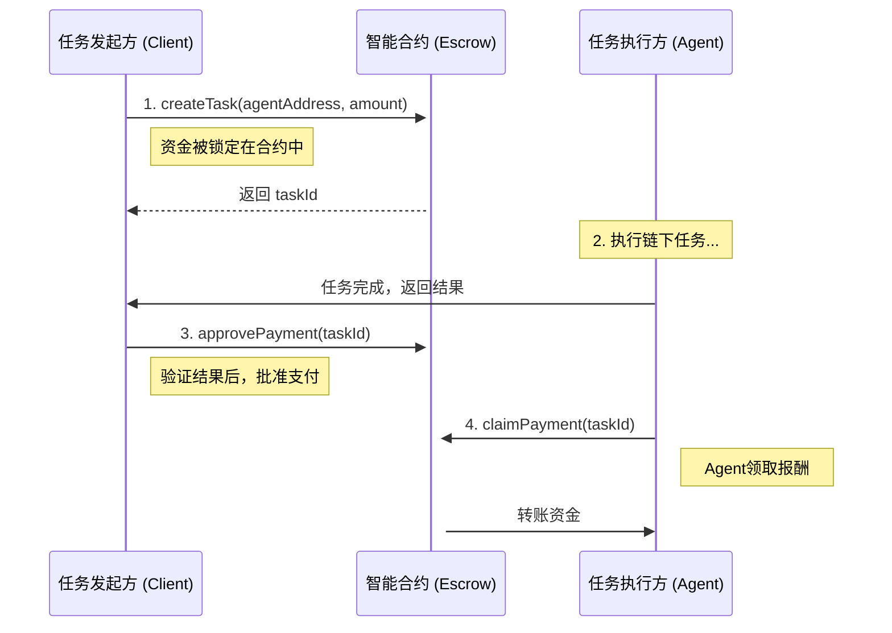

# **Mycelium Protocol** 🤖💸

[](https://github.com/your-repo/pay-agents-protocol) [](https://opensource.org/licenses/MIT)

**Stripe for AI Agents. 在5分钟内为你的AI Agent接入去中心化、任务驱动的链上支付功能。**

随着AI Agent（如AutoGPT、LangChain Agents）变得日益强大，它们需要一个原生的、程序化的、无需信任的经济层来进行协作和价值交换。Mycelium Protocol正是为此而生，它为未来的“机器经济”提供最简单的支付基础设施。

## 核心特性

*   **⚡ 极致简单**: 我们将所有Web3的复杂性（ABI, Gas, Provider）都封装起来。你只需要调用几个简单的异步函数，感觉就像在用普通的Web API。
*   **🔒 任务托管**: 采用经典的“锁定-批准-领取”托管模型。任务发起方（Client）先将资金锁定在智能合约中，任务执行方（Agent）完成后，发起方批准，执行方即可领取报酬。
*   **🤖 为自动化而生**: 专为程序化调用设计，让Agent之间的自主协作和结算成为可能。
*   **⛽ 超低费用**: 部署在Polygon网络上，每笔交易的成本不到0.01美元，非常适合高频次的Agent交互。

## 它是如何工作的？

整个流程被设计得清晰明了，由四个核心步骤组成：



---

## ⚠️ 重要：V1版本的信任模型（必读）

**Mycelium Protocol V1 采用的是“客户端信任模型”。**

这意味着，**任务是否“完成”的判断权，以及是否调用 `approvePayment` 的决定权，完全掌握在任务发起方（Client）的手中。**

智能合约本身无法知道链下的任务是否真的被完美执行。它只认Client的指令。

#### V1适用场景:

*   **内部系统**: 在一个组织内部，不同的Agent服务相互调用和结算。
*   **受信任的参与方**: 你正在与一个有良好声誉的、非匿名的实体进行交互。
*   **低价值任务**: 单次任务的金额较小，潜在的违约风险可以接受。

#### V1不适用场景:

*   在完全开放、匿名的网络中，与一个你完全不了解的Client进行高价值的任务交互。在这种情况下，Agent将面临Client完成任务后不付款的风险。

**我们将在未来的版本中引入链上声誉系统和去中心化仲裁机制来解决这个信任问题。但V1的目标是优先保证极致的简洁性。**

---

## 🚀 5分钟快速上手指南

只需三步，即可在Polygon Mumbai测试网上完成你的第一次Agent支付。

### 第0步：准备工作 (Web3新手看这里)

1.  **安装钱包**: 在你的浏览器（Chrome/Firefox）中安装 [MetaMask](https://metamask.io/) 插件。
2.  **创建账户**: 按照指引创建一个新的钱包账户，**务必安全备份你的助记词**。
3.  **切换网络**: 在MetaMask中，将网络从“以太坊主网”切换到“Polygon Mumbai”测试网。
4.  **获取测试币**: 访问一个公共的Mumbai水龙头（[Polygon Faucet](https://faucet.polygon.technology/)），输入你的钱包地址，免费领取一些测试用的`MATIC`代币。
5.  **导出私钥**: 在MetaMask中，点击账户详情 -> 导出私钥。你将需要这个私钥来初始化SDK。

### 第1步：安装SDK

**For JavaScript/TypeScript:**
```bash
npm install pay-agents-sdk
```

**For Python:**
```bash
pip install pay-agents-sdk```

### 第2步：Client端 - 创建并批准任务

在你的后端代码中（例如Node.js或Python脚本），创建一个任务。

**切勿在前端代码中暴露你的私钥！** 建议使用环境变量来管理。

**JavaScript示例 (`client.js`):**
```javascript
const { PayAgentsSDK } = require('pay-agents-sdk');

// 强烈建议使用环境变量来加载你的私钥！
const CLIENT_PRIVATE_KEY = "0x..."; // 你的客户端钱包私钥
const RPC_URL = "https://rpc-mumbai.maticvigil.com"; // Polygon Mumbai测试网RPC
const CONTRACT_ADDRESS = "0x..."; // 我们部署的合约地址

const sdk = new PayAgentsSDK(CLIENT_PRIVATE_KEY, RPC_URL, CONTRACT_ADDRESS);

async function main() {
    const agentAddress = "0xAgentWalletAddress"; // 接收任务的Agent钱包地址
    console.log(`Creating task to pay Agent ${agentAddress}...`);

    // 1. 创建任务并锁定 0.01 MATIC
    const { taskId } = await sdk.createTask(agentAddress, "0.01");
    console.log(`Task created with ID: ${taskId}. Waiting for Agent to complete...`);

    // --- 在这里，等待你的Agent完成工作 ---
    // (例如，一个API调用完成，一个文件处理完毕等)
    console.log("Agent has completed the task. Approving payment...");

    // 2. 批准支付
    await sdk.approvePayment(taskId);
    console.log(`Payment for task ${taskId} has been approved! Agent can now claim it.`);
}

main().catch(console.error);
```

### 第3步：Agent端 - 领取报酬

Agent完成任务后，可以轮询任务状态，一旦状态变为`Approved`，即可领取报酬。

**Python示例 (`agent.py`):**
```python
import os
import time
from pay_agents_sdk import PayAgentsSDK

# 强烈建议使用环境变量！
AGENT_PRIVATE_KEY = "0x..." # Agent的钱包私钥
RPC_URL = "https://rpc-mumbai.maticvigil.com"
CONTRACT_ADDRESS = "0x..." # 同样的合约地址

sdk = PayAgentsSDK(AGENT_PRIVATE_KEY, RPC_URL, CONTRACT_ADDRESS)

def claim_my_reward(task_id):
    print(f"Checking status for task {task_id}...")
    while True:
        status = sdk.get_task_status(task_id)
        print(f"Current status: {status}")
        
        if status == 'Approved':
            print("Payment approved! Claiming now...")
            sdk.claim_payment(task_id)
            print(f"Payment for task {task_id} successfully claimed!")
            break
        elif status in ['Paid', 'Cancelled']:
            print(f"Task is already in final state: {status}.")
            break
            
        time.sleep(10) # 每10秒检查一次

# 假设Agent从某个地方得知了需要处理的taskId
task_id_to_claim = 123 
claim_my_reward(task_id_to_claim)
```

---

## 🔐 安全须知

**你的私钥就是你资金的唯一凭证。**

*   **绝对不要** 将你的私钥硬编码在代码中。
*   **绝对不要** 将包含私钥的文件提交到Git等版本控制系统。
*   **绝对不要** 在任何前端或客户端代码中暴露私钥。
*   请始终使用**环境变量**或安全的密钥管理服务来加载你的私钥。

## 🤝 贡献

我们欢迎所有形式的贡献！如果你有任何想法、建议或发现Bug，请随时提交Issue或Pull Request。

## 📄 许可证

本项目采用 [MIT License](./LICENSE)。