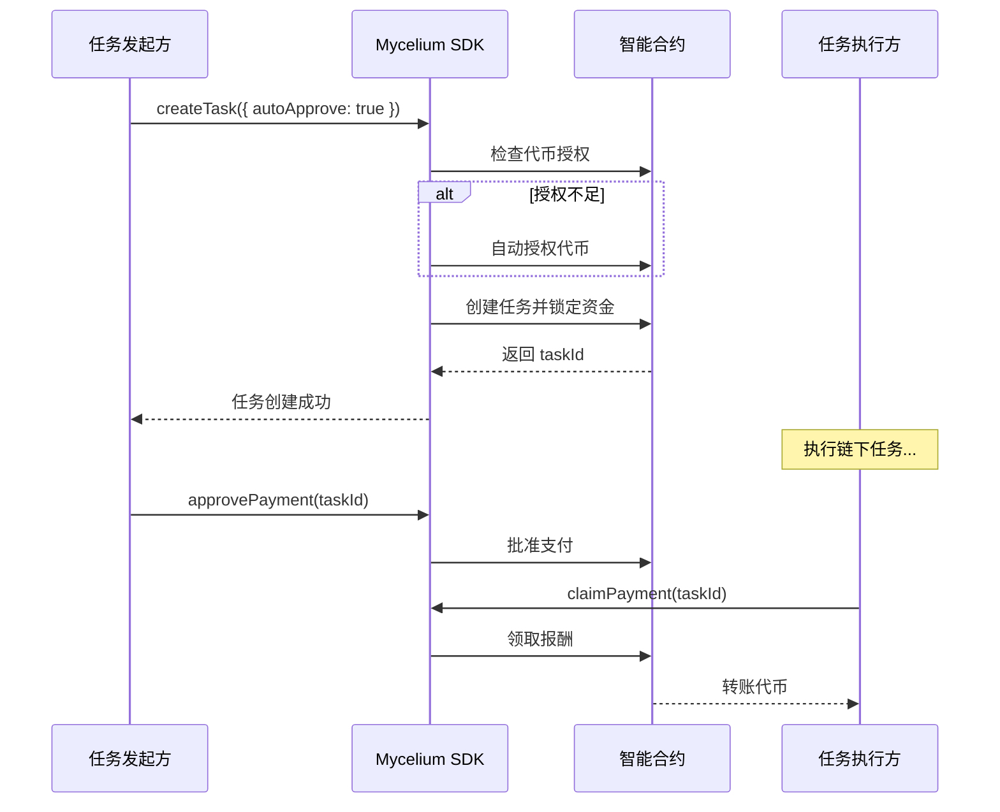

# Mycelium Protocol 🍄💸

[](https://github.com/mycelium-protocol/mycelium-protocol) [](https://opensource.org/licenses/MIT) [](./sdk-js/) [](./sdk-js/src/types.d.ts)

> [English](./README_EN.md) | 中文

**Mycelium Protocol 是一个为自主 AI Agent 经济打造的、生产级的去中心化支付基础设施。** 它提供了一个安全、可靠、低成本的结算层，让 AI Agent 之间的协作和价值交换变得简单而无需信任。

随着 AI Agent 变得日益强大，它们需要一个原生的经济层。Mycelium Protocol 正是为此而生，它旨在成为未来"机器经济"的可信支付网络。

## 🚀 快速开始

```bash
npm install @mycelium-protocol/sdk-js ethers
```

```javascript
import { MyceliumSDK } from '@mycelium-protocol/sdk-js';

// 初始化 SDK
const sdk = MyceliumSDK.withPrivateKey(process.env.PRIVATE_KEY);

// 创建任务（自动处理代币授权）
const task = await sdk.createTask({
  agentAddress: '0x...',
  tokenAddress: '0x...', // USDC 地址
  amount: '100',
  metadata: { description: 'AI 数据分析任务' },
  options: { autoApprove: true } // 🔥 自动授权，无缝体验
});

console.log('任务已创建:', task.taskId);
```

## 核心特性 (V1 - Escrow Pay)

* **🤝 ERC20 稳定币优先**: 专为稳定币（如 USDC, USDT, DAI）设计，避免价格波动，实现精确支付
* **🔒 任务托管 (Escrow)**: 采用经典的"锁定-批准-领取"托管模型，资金安全有保障
* **⚡ 自动授权**: 一键创建任务，SDK 自动处理代币授权，提供 Uniswap 级别的用户体验
* **⛽ 智能 Gas 优化**: 自动估算 Gas 费用并添加 20% 缓冲，减少交易失败率
* **🛡️ 生产级安全**:
    * **管理员控制**: 集成 OpenZeppelin 的 `Ownable` 和 `Pausable`，具备紧急暂停功能
    * **SafeERC20**: 全面使用 `SafeERC20` 库，确保与各类 ERC20 代币的交互安全
    * **防御特殊代币**: 智能处理"转账收费"代币，防止资金被意外锁定
    * **经过全面测试**: 核心合约经过了 100% 的功能和逻辑覆盖测试
* **📄 链上元数据**: 支持将任务的元数据哈希（如 IPFS CID）上链，为任务验证和争议仲裁提供依据
* **💻 开发者友好**: 完整的 TypeScript 支持、详细文档、丰富示例

## 🎯 项目状态

| 组件 | 状态 | 描述 |
|------|------|------|
| **智能合约** | ✅ 生产就绪 | 已部署到 Polygon Amoy，经过全面测试 |
| **JavaScript SDK** | ✅ 生产就绪 | 完整功能，自动授权，Gas 优化 |
| **TypeScript 支持** | ✅ 完整支持 | 类型定义文件，完整 IntelliSense |
| **Python SDK** | 🚧 开发中 | 即将发布 |
| **文档** | ✅ 完整 | 开发者指南，API 参考，示例代码 |

## 📦 SDK 特性

### 🔥 自动授权 (Auto-Approval)
```javascript
// 无缝用户体验 - 自动处理代币授权
const result = await sdk.createTask({
  // ... 任务参数
  options: { autoApprove: true }
});

if (result.approvalTransaction) {
  console.log('自动授权成功:', result.approvalTransaction.transactionHash);
}
```

### ⛽ 智能 Gas 优化
```javascript
// 自动估算最优 Gas 费用
const task = await sdk.createTask({
  // ... 参数
  options: { 
    estimateGas: true,  // 自动估算 + 20% 缓冲
    autoApprove: true 
  }
});
```

### 🌐 多环境支持
```javascript
// 后端 (Node.js)
const sdk = MyceliumSDK.withPrivateKey(privateKey);

// 前端 (浏览器 + MetaMask)
const sdk = MyceliumSDK.withBrowserProvider(window.ethereum);

// 只读模式
const sdk = MyceliumSDK.withRPC('https://rpc-amoy.polygon.technology');
```

## 🏗️ 部署信息

* **合约地址**: `0x9815231475dEEB0588E86A0B1FbD5E6aAEd90987`
* **网络**: Polygon Amoy 测试网 (Chain ID: 80002)
* **浏览器**: [在 Amoy PolygonScan 上查看](https://amoy.polygonscan.com/address/0x9815231475dEEB0588E86A0B1FbD5E6aAEd90987)

## 📚 文档和示例

* **[开发者指南](./sdk-js/DEVELOPER_GUIDE.md)** - 完整的 API 参考和最佳实践
* **[自动授权示例](./sdk-js/examples/auto-approve.js)** - 无缝用户体验演示
* **[Gas 优化示例](./sdk-js/examples/gas-optimization.js)** - 智能 Gas 管理
* **[前端集成示例](./sdk-js/examples/frontend-integration.js)** - MetaMask 集成指南

## 🔄 工作流程

整个流程被设计得安全而高效，SDK 自动处理代币授权和任务创建：

1. **自动授权**: SDK 自动检查代币授权并在需要时进行授权
2. **创建任务**: 客户端调用 `createTask`，资金被安全锁定在托管合约中
3. **执行任务**: Agent 执行链下工作
4. **批准支付**: 客户端验证任务完成后调用 `approvePayment`
5. **领取报酬**: Agent 调用 `claimPayment` 领取锁定的代币



## 🤝 贡献

Mycelium Protocol 是一个开源项目，我们欢迎所有形式的贡献！如果你对为 AI Agent 构建支付未来充满热情，请随时：

* **开启一个 Issue**: 报告 Bug 或提出功能建议
* **提交 Pull Request**: 改进代码或文档
* **加入讨论**: 在 GitHub Discussions 中分享你的想法

## 📄 许可证

本项目采用 [MIT License](./LICENSE)。

## 🔗 链接

* **[智能合约](./smart-contract/)** - Solidity 合约和部署脚本
* **[JavaScript SDK](./sdk-js/)** - 完整的 SDK 和 TypeScript 支持
* **[Python SDK](./sdk-py/)** - Python 实现（即将发布）
* **[开发者指南](./sdk-js/DEVELOPER_GUIDE.md)** - 完整文档
* **[示例代码](./sdk-js/examples/)** - 实际集成示例