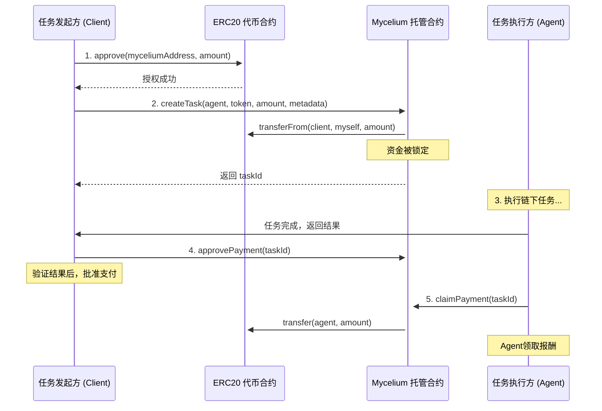

# Mycelium Protocol 🍄💸

  

**Mycelium Protocol 是一个为自主 AI Agent 经济打造的、生产级的去中心化支付基础设施。** 它提供了一个安全、可靠、低成本的结算层，让 AI Agent 之间的协作和价值交换变得简单而无需信任。

随着 AI Agent 变得日益强大，它们需要一个原生的经济层。Mycelium Protocol 正是为此而生，它旨在成为未来“机器经济”的可信支付网络。

## 核心特性 (V1 - Escrow Pay)

* **🤝 ERC20 稳定币优先**: 专为稳定币（如 USDC, USDT, DAI）设计，避免价格波动，实现精确支付。
* **🔒 任务托管 (Escrow)**: 采用经典的“锁定-批准-领取”托管模型。任务发起方将资金安全锁定在合约中，任务完成后批准支付，执行方即可领取报酬。
* **🛡️ 生产级安全**:
    * **管理员控制**: 集成 OpenZeppelin 的 `Ownable` 和 `Pausable`，具备紧急暂停功能，保护用户资金。
    * **SafeERC20**: 全面使用 `SafeERC20` 库，确保与各类 ERC20 代币的交互安全。
    * **防御特殊代币**: 智能处理“转账收费”代币，防止资金被意外锁定。
    * **经过全面测试**: 核心合约经过了 100% 的功能和逻辑覆盖测试。
* **📄 链上元数据**: 支持将任务的元数据哈希（如 IPFS CID）上链，为任务验证和未来的争议仲裁提供不可篡改的依据。
* **⛽ 超低费用**: 部署在 Polygon 网络上，每笔交易的成本极低，非常适合高频次的 Agent 交互。

## 状态：V1 核心合约已完成并部署！

**Mycelium Protocol 的 V1 核心智能合约 `TaskEscrowERC20.sol` 已经开发完成，并成功部署到了 Polygon Amoy 测试网！**

* **合约地址**: `0x9815231475dEEB0588E86A0B1FbD5E6aAEd90987`
* **查看合约**: [在 Amoy PolygonScan 上查看](https://amoy.polygonscan.com/address/0x9815231475dEEB0588E86A0B1FbD5E6aAEd90987)

我们正在全力开发与之配套的 JavaScript 和 Python SDK，敬请期待！

## 它是如何工作的？

整个流程被设计得安全而高效，由两笔链上交易和一笔链下批准组成：

1. **授权 (Approve)**: `Client` 首先调用 ERC20 代币合约，授权 Mycelium 合约可以动用其指定额度的资金。
2. **创建任务 (createTask)**: `Client` 调用 Mycelium 合约的 `createTask` 函数。合约会安全地从 `Client` 钱包中“拉取”已授权的资金并锁定。
3. **批准支付 (approvePayment)**: 任务完成后，`Client` 调用 `approvePayment` 函数，授权支付。
4. **领取报酬 (claimPayment)**: `Agent` 调用 `claimPayment` 函数，从合约中领取属于自己的报酬。

---

## 🤝 贡献

Mycelium Protocol 是一个开源项目，我们欢迎所有形式的贡献！如果你对为 AI Agent 构建支付未来充满热情，请随时：

* **开启一个 Issue**: 报告 Bug 或提出功能建议。
* **提交 Pull Request**: 改进代码或文档。
* **加入讨论**: 在 GitHub Discussions 中分享你的想法。

## 📄 许可证

本项目采用 [MIT License](./LICENSE)。
