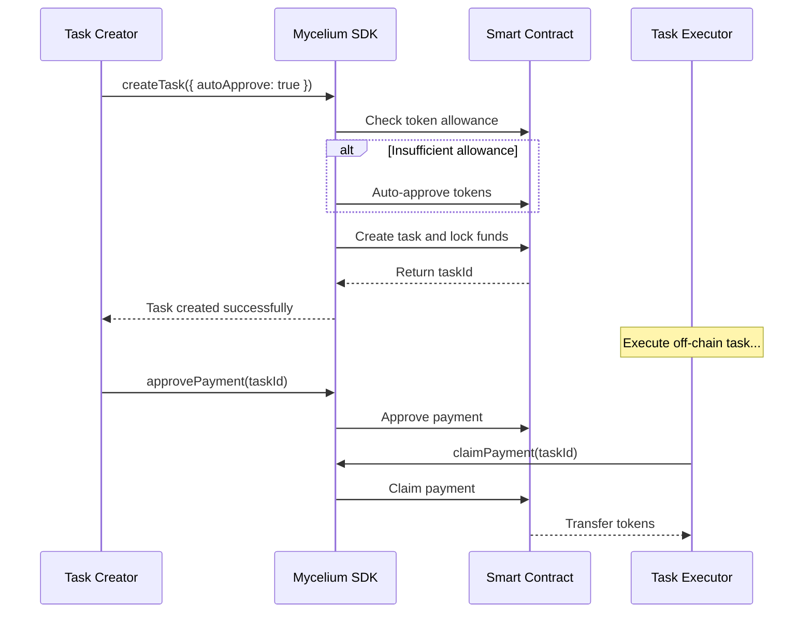

# Mycelium Protocol 🍄💸

[](https://github.com/mycelium-protocol/mycelium-protocol) [](https://opensource.org/licenses/MIT) [](./sdk-js/) [](./sdk-js/src/types.d.ts)

> English | [中文](./README.md)

**Mycelium Protocol is a production-grade decentralized payment infrastructure designed for autonomous AI Agent economies.** It provides a secure, reliable, and low-cost settlement layer that makes collaboration and value exchange between AI Agents simple and trustless.

As AI Agents become increasingly powerful, they need a native economic layer. Mycelium Protocol is built for this purpose, aiming to become the trusted payment network for the future "machine economy."

## 🚀 Quick Start

```bash
npm install @mycelium-protocol/sdk-js ethers
```

```javascript
import { MyceliumSDK } from '@mycelium-protocol/sdk-js';

// Initialize SDK
const sdk = MyceliumSDK.withPrivateKey(process.env.PRIVATE_KEY);

// Create task with automatic token approval
const task = await sdk.createTask({
  agentAddress: '0x...',
  tokenAddress: '0x...', // USDC address
  amount: '100',
  metadata: { description: 'AI data analysis task' },
  options: { autoApprove: true } // 🔥 Auto-approval for seamless UX
});

console.log('Task created:', task.taskId);
```

## Core Features (V1 - Escrow Pay)

* **🤝 ERC20 Stablecoin First**: Designed specifically for stablecoins (USDC, USDT, DAI) to avoid price volatility and enable precise payments
* **🔒 Task Escrow**: Classic "lock-approve-claim" escrow model where funds are safely locked in contract until task completion
* **⚡ Auto-Approval**: One-click task creation with SDK automatically handling token approvals for Uniswap-level UX
* **⛽ Smart Gas Optimization**: Automatic gas estimation with 20% buffer to reduce transaction failure rates
* **🛡️ Production-Grade Security**:
    * **Admin Controls**: Integrated OpenZeppelin `Ownable` and `Pausable` with emergency pause functionality
    * **SafeERC20**: Comprehensive use of `SafeERC20` library for secure token interactions
    * **Fee-on-Transfer Protection**: Smart handling of fee-on-transfer tokens to prevent fund lockup
    * **Comprehensive Testing**: Core contracts with 100% functional and logic test coverage
* **📄 On-Chain Metadata**: Support for task metadata hashes (IPFS CID) for verification and dispute resolution
* **💻 Developer-Friendly**: Complete TypeScript support, detailed documentation, rich examples

## 🎯 Project Status

| Component | Status | Description |
|-----------|--------|-------------|
| **Smart Contract** | ✅ Production Ready | Deployed on Polygon Amoy, fully tested |
| **JavaScript SDK** | ✅ Production Ready | Complete features, auto-approval, gas optimization |
| **TypeScript Support** | ✅ Full Support | Type definitions, complete IntelliSense |
| **Python SDK** | 🚧 In Development | Coming soon |
| **Documentation** | ✅ Complete | Developer guide, API reference, examples |

## 📦 SDK Features

### 🔥 Auto-Approval
```javascript
// Seamless UX - automatic token approval handling
const result = await sdk.createTask({
  // ... task parameters
  options: { autoApprove: true }
});

if (result.approvalTransaction) {
  console.log('Auto-approved tokens:', result.approvalTransaction.transactionHash);
}
```

### ⛽ Smart Gas Optimization
```javascript
// Automatic optimal gas fee estimation
const task = await sdk.createTask({
  // ... parameters
  options: { 
    estimateGas: true,  // Auto-estimate + 20% buffer
    autoApprove: true 
  }
});
```

### 🌐 Multi-Environment Support
```javascript
// Backend (Node.js)
const sdk = MyceliumSDK.withPrivateKey(privateKey);

// Frontend (Browser + MetaMask)
const sdk = MyceliumSDK.withBrowserProvider(window.ethereum);

// Read-only mode
const sdk = MyceliumSDK.withRPC('https://rpc-amoy.polygon.technology');
```

## 🏗️ Deployment Info

* **Contract Address**: `0x9815231475dEEB0588E86A0B1FbD5E6aAEd90987`
* **Network**: Polygon Amoy Testnet (Chain ID: 80002)
* **Explorer**: [View on Amoy PolygonScan](https://amoy.polygonscan.com/address/0x9815231475dEEB0588E86A0B1FbD5E6aAEd90987)

## 📚 Documentation & Examples

* **[Developer Guide](./sdk-js/DEVELOPER_GUIDE.md)** - Complete API reference and best practices
* **[Auto-Approval Example](./sdk-js/examples/auto-approve.js)** - Seamless UX demonstration
* **[Gas Optimization Example](./sdk-js/examples/gas-optimization.js)** - Smart gas management
* **[Frontend Integration Example](./sdk-js/examples/frontend-integration.js)** - MetaMask integration guide

## 🔄 How It Works

The entire process is designed to be secure and efficient, consisting of automated token approval and task creation:

1. **Auto-Approval**: SDK automatically checks token allowance and approves if needed
2. **Create Task**: Client calls `createTask` and funds are safely locked in the escrow contract
3. **Execute Task**: Agent performs the off-chain work
4. **Approve Payment**: Client calls `approvePayment` after verifying task completion
5. **Claim Payment**: Agent calls `claimPayment` to receive the locked tokens



## 🤝 Contributing

Mycelium Protocol is an open-source project, and we welcome all forms of contributions! If you're passionate about building the payment future for AI Agents, please feel free to:

* **Open an Issue**: Report bugs or suggest features
* **Submit a Pull Request**: Improve code or documentation
* **Join Discussions**: Share your ideas in GitHub Discussions

## 📄 License

This project is licensed under the [MIT License](./LICENSE).

## 🔗 Links

* **[Smart Contract](./smart-contract/)** - Solidity contracts and deployment scripts
* **[JavaScript SDK](./sdk-js/)** - Complete SDK with TypeScript support
* **[Python SDK](./sdk-py/)** - Python implementation (coming soon)
* **[Developer Guide](./sdk-js/DEVELOPER_GUIDE.md)** - Comprehensive documentation
* **[Examples](./sdk-js/examples/)** - Practical integration examples